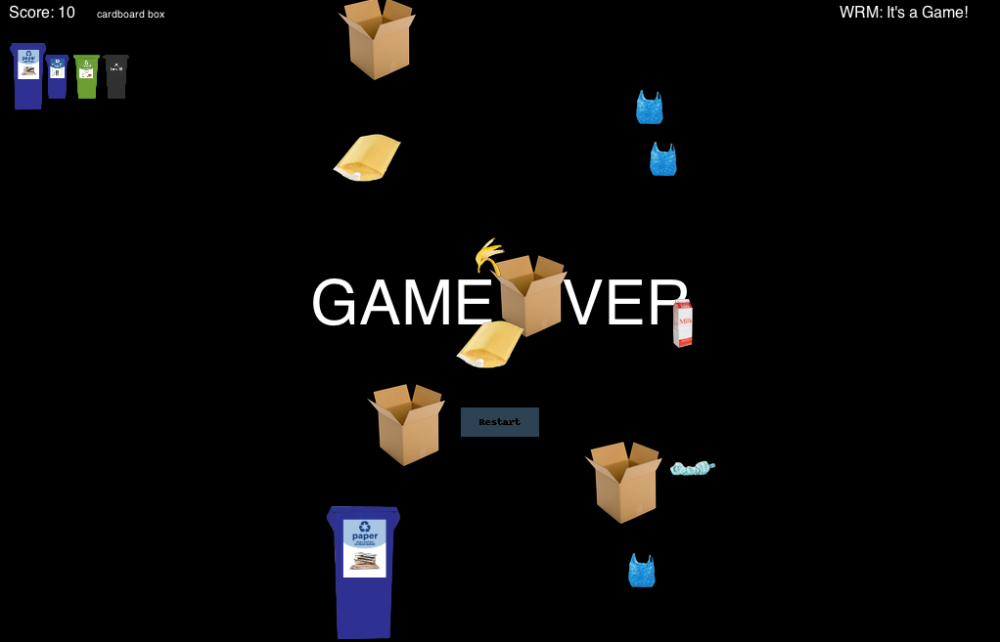

# WRM Game

This is a trash sorting game made for the [BSC](https://www.bsc.coop/).

# Setting up:

The first thing you'll need is python. I used python 3 and a library called
pyglet. With python 3 installed, and in the terminal you can run:

```
pip3 install pyglet
```

After that downloads, navigate to the directory you'd like the project in and
run:

```
git clone https://github.com/kevin-corcoran/WRM_Game.git
```

Change directory and run the game

```
cd wrm/
python3 wrm.py
```



